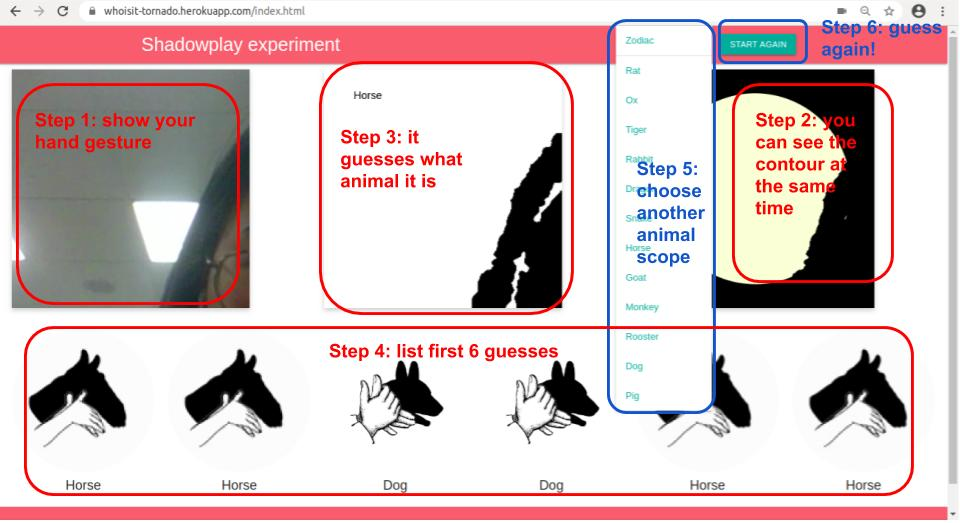

## User Guide


## Project Structure

```bash
├── Aptfile # configuration for Heroku
├── artifacts # save ssl certificates and machine info
├── crop_mosaic.py # crop mosaic image
├── data # training image
├── dataformat.py # prepare images for training and production
├── docs # more detailed documents from zodiac_google
├── generator.py # A neural network sub-module for training
├── imageprocess.py # extract contours with fixed length
├── launch.py # pull from GitHub and start service
├── momentnet.py # CNN model written in TensorFlow
├── process.py # classify images with model and templates
├── Procfile # configuration for Heroku
├── README.md
├── requirements.txt # Python virtual environment packages list
├── semanticquery.py # SPARQL
├── server.py # web server and APIs
├── simplified_unet.h5 # trained U-Net model and weights
├── tasks # rename images
│   ├── categories_generate_temp
│   ├── categories_temp
│   ├── gen_format.py
│   └── rename.py
├── templates # template images and their sources
│   ├── Tiger
│   └── Tiger.txt
├── test.py # test the classification model
├── train.py # train the classification model
├── util.py # image processing utility
├── web # frontend folder
│   ├── css
│   ├── index.html
│   ├── jquery-3.2.1.min.js
│   ├── model
│   ├── one_hand_zodiac
│   ├── opencv.js
│   ├── preprocessing.js
│   └── shadow.js
└── weight_sets # save the classification model's weights
    ├── test_1
    └── test_2
```

## APIs

```bash
# GET /(.*)
# request static files in web directory

# GET /
# redirect to index page
```
```bash
# POST /classify
# classify image with current weights set and templates
curl -X POST http://localhost:7788/classify
--data-raw '{"image":"data:image/png;base64...","reference":"2019-10-29"}

{"reference":"2019-10-29","classes":{"name": "Horse", "thumbnail":
"https://whoisit-tornado.herokuapp.com/zodiac/horse.png", "uri":
"http://dbpedia.org/page/Horse"},"raw":[4.956057e-08],"flip":[true]}
```

```bash
# GET /set
# get current weights set and templates status
curl http://localhost:7788/set

{"current":0, "sets":[{"api_version": "1.0", "date_created": "2019-10-21 17:51:58", "from_date": "2019-10-15",
"num_layers": 5, "output_classes": 16, "session_name": "test_2/test", "set_list": "dataset_1", "size": [256, 32],
"to_date": "2019-10-22"},{"api_version": "1.0", "date_created": "2019-10-18 10:48:18", "from_date": null, "num_layers":
5, "output_classes": 16, "session_name": "test_1/test", "set_list": "dataset_1", "size": [256, 32], "to_date": null}],
"current_template":0, "templates":["Bear","template_1"]}

# POST /set
# change weights set and templates by their index number
curl -X POST http://localhost:7788/set
--data-raw '{"index":1,"template":1}'

{"success":true}
```

```bash
# GET /download.tar.gz
# download weights and templates
curl http://localhost:7788/download.tar.gz --output data.tar.gz
```

```bash
# POST /set/dbpedia/{animalName}
# update templates with DBpedia's thumbnail pictures
curl -X POST http://localhost:7788/set/dbpedia/Bear
{"success": true, "templates_list": ["Bear", "template_1"]}
```

```bash
# POST /classify/newTemplates
curl -X POST http://localhost:7788/classify/newTemplates
--data-raw '{"image":"data:image/png;base64...", "templates":{"bird":["https://www.sciencesource.com/Doc/TR1_WATERMARKED/4/2/3/9/SS2518383.jpg?d63642579893","https://image.shutterstock.com/image-vector/shadow-puppet-bird-vintage-engraved-260nw-96195749.jpg"],"dog":["https://cdn.drawception.com/images/panels/2015/3-4/APRwccXaQx-8.png","https://i.pinimg.com/originals/b4/bb/0a/b4bb0aa59627e0cb2e1209cdcf2907b8.jpg"]},
"reference":"2019-10-29"}

{"reference":"2019-10-29","classes":bird,"raw":[1.0],"flip":[true]}
```
```bash
# POST /crop
curl -X POST http://localhost:7788/crop
--data-raw '{ "url":"https://upload.wikimedia.org/wikipedia/commons/thumb/d/d9/Family_Cervidae_five_species.jpg/300px-Family_Cervidae_five_species.jpg"}'

{"coordinates":[(0.0, 0.0, 148.828125, 337.67578125), (148.828125, 0.0, 298.828125, 337.67578125)]}
```

```bash
# GET /dbpedia/subEntity/{animalName}
# list animals sub-entity from DBpedia
curl http://localhost:7788/dbpedia/subEntity/Tiger

{"results": [{"name": "Tiger of Segur", "uri": "http://dbpedia.org/resource/Tiger_of_Segur", "thumbnail": "http://commons.wikimedia.org/wiki/Special:FilePath/Man-eater_of_Segur.jpg?width=300"}, {"name": "Shere Khan", "uri": "http://dbpedia.org/resource/Shere_Khan", "thumbnail": "http://commons.wikimedia.org/wiki/Special:FilePath/Mowgli-vs-sherekhan.jpg?width=300"}, {"name": "Tiger 131", "uri": "http://dbpedia.org/resource/Tiger_131", "thumbnail": "http://commons.wikimedia.org/wiki/Special:FilePath/Tiger_131_(7527948486).jpg?width=300"}, {"name": "Li Quan (wildlife conservationist)", "uri": "http://dbpedia.org/resource/Li_Quan_(wildlife_conservationist)", "thumbnail": "http://en.wikipedia.org/wiki/Special:FilePath/Li_Quan_with_Tiger.jpg?width=300"}, {"name": "Golden tiger", "uri": "http://dbpedia.org/resource/Golden_tiger", "thumbnail": "http://commons.wikimedia.org/wiki/Special:FilePath/Golden_tiger_1_-_Buffalo_Zoo.jpg?width=300"}, {"name": "T-24 (tiger)", "uri": "http://dbpedia.org/resource/T-24_(tiger)", "thumbnail": "http://commons.wikimedia.org/wiki/Special:FilePath/T24_20120504.jpg?width=300"}, {"name": "Amur and Timur", "uri": "http://dbpedia.org/resource/Amur_and_Timur", "thumbnail": "http://commons.wikimedia.org/wiki/Special:FilePath/Amur_and_Timur_003.jpg?width=300"}]}
```
## Usages

### Training
`python3 train.py --list <directory name> --iter <iterations> --name <weight set name>`

Example:
`python3 train.py --list data_1 data_2 data_3 --iter 1000 --name new_weight_set`


### Start server
`python3 server.py`

### Start via launcher
`python3 launch.py`
